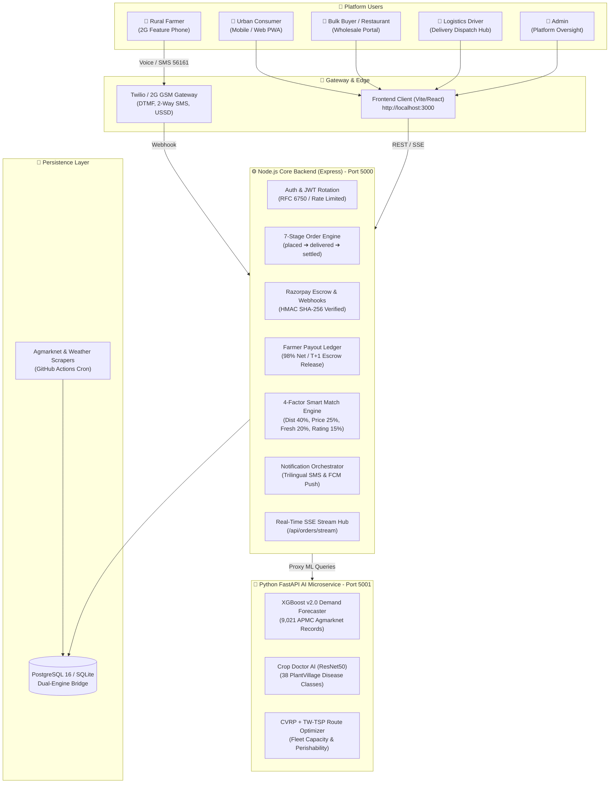

# 🌾 FarmToHome (KisanSetu)

> **Direct Farm-to-Doorstep Agriculture Marketplace with 2G Voice AI & Direct Cold Logistics**  
> *Built for Smart India Hackathon (SIH 2026) | Clean Production Architecture*

---

## 📌 Project Overview

**FarmToHome** is an end-to-end direct agricultural platform bridging rural farmers and urban consumers:
- **For Rural Farmers (No Smartphone):** 2G feature phone IVR & Voice AI in native Tamil/Hindi using Twilio & Sarvam AI. Farmers can list crops, check earnings, and verify orders by dialing a phone number.
- **For Urban Consumers & Buyers:** High-performance responsive web marketplace with smart proximity-based matching, direct doorstep delivery, and zero middlemen markup.
- **For Logistics Drivers:** Direct farm-to-consumer dispatch routing with real road geometry (OSRM), animated delivery tracking, and Proof of Delivery (POD).
- **For AI/ML Insights:** Demand forecasting (Random Forest/XGBoost), 2-Opt TSP route optimization, and ESG carbon emission metrics.

---

## 🚀 6-Layer Production Architecture & Team Roster

| Layer | Focus Area | Primary Owner | Status |
|:---|:---|:---|:---:|
| **Layer 1** | **PostgreSQL 16 Migration, Auth Hardening, Rate Limiting** | **M1 (Backend Architect)** | ✅ **COMPLETED** |
| **Layer 2** | **Core API Rebuild, Razorpay Escrow (Test Mode), SMS & Payouts** | **M1 (Backend Architect)** | ✅ **COMPLETED** |
| **Layer 3** | **APMC Agmarknet Training, Crop Doctor AI, Route Optimizer** | **M3 + M6** | ✅ **COMPLETED** |
| **Layer 4** | **Production Frontend PWA, Design System, Live Tracking & Telephony** | **M2 (Frontend Lead)** | ✅ **COMPLETED** |
| **Layer 5** | **Multi-Language IVR (Telugu/Kannada), WhatsApp Bot, Call Funnel Analytics** | **M4 (Telephony Engineer)** | ✅ **COMPLETED** |
| **Layer 6** | **10 E2E Journey Tests, OWASP Security Audit, Concurrency Benchmarks** | **M6 + M1** | ✅ **COMPLETED** |

📄 **Full Team Production Plan:** See [`KisanSetu_Production_Build_Plan.pdf`](./KisanSetu_Production_Build_Plan.pdf)

---

## 🏛️ System Architecture Diagram



---

## 💰 Zero-Cost Production Stack (₹0/Month)

| Component | Technology / Free Provider | Free Tier Specification |
|:---|:---|:---|
| **Database** | [Neon PostgreSQL](https://neon.tech) | 0.5 GB storage, auto-suspend |
| **Backend API** | [Render](https://render.com) | 750 hrs/mo free web service |
| **Frontend UI** | [Vercel](https://vercel.com) | Unlimited static hosting, CDN, SSL |
| **AI Microservice** | [Hugging Face Spaces](https://huggingface.co/spaces) | 2 vCPU, 16 GB RAM free CPU |
| **Cache & Store** | [Upstash Redis](https://upstash.com) | 10,000 commands/day free |
| **Media Storage** | [Supabase Storage](https://supabase.com) | 1 GB free bucket storage |
| **DNS & Security** | [Cloudflare](https://cloudflare.com) | Free SSL, DDoS mitigation |
| **Voice / SMS** | [Twilio Trial](https://twilio.com) | $15 free trial credit |
| **Voice AI Engine** | Amazon Polly (Aditi Indian voice) | Native in-carrier synthesis |

---

## 🛠️ Quick Start Guide

### Prerequisites
- Node.js (v18+)
- Python (3.10+)

### 1. Backend Server Setup
```bash
cd server
npm install
npm run migrate    # Verifies database schema and runs migrations
npm start          # Runs on http://localhost:5000
```
Health check: `http://localhost:5000/api/health`

### 2. Frontend Setup
```bash
cd client
npm install
npm run dev        # Runs on http://localhost:3000
```

### 3. AI Microservice Setup
```bash
cd ai-service
pip install -r requirements.txt
python app.py      # Runs on http://localhost:5001
```

---

## 🔒 Security & Quality Features (Layer 1)
- **DDoS / Brute-Force Rate Limiting:** Applied to authentication & OTP endpoints (`express-rate-limit`).
- **Strict Input Validation:** Indian phone numbers (`^[6-9]\d{9}$`), IFSC codes, and passwords validated via `express-validator`.
- **Dual-Engine Persistence:** Automatic SQLite fallback locally, seamless PostgreSQL connection pooling via `DATABASE_URL` in production.
- **Health & Metrics Monitoring:** Real-time uptime, memory, and database status endpoint at `/api/health`.

---

## 🎨 Progressive Web App & Design System (Layer 4)
- **Token-Based Design System:** Comprehensive UI tokens for colors, typography, elevations, spacing, and dark mode toggle.
- **Offline-First PWA:** Service Worker (`sw.js`) with static asset pre-caching, IndexedDB (`idb`) offline cart persistence, and background sync.
- **Real-Time Live Tracking:** Interactive delivery map tracking driver transit with simulated GPS breadcrumbs and SSE event updates.
- **Professional Analytics & Exports:** Farmer dashboard CSV export via `PapaParse`, Buyer invoice PDF generation via `jsPDF` & `jspdf-autotable`.
- **Live Mandi Ticker & Notification Center:** Real-time APMC price marquee ticker and trilingual alert bell with unread counters.

---

## 📞 Telephony, Multi-Language IVR & WhatsApp Bot (Layer 5 M4)
- **Multi-Language Indic IVR Expansion:** Fully localized DTMF voice menus supporting **5 languages** — Tamil (`ta-IN`), Hindi (`hi-IN`), Telugu (`te-IN`), Kannada (`kn-IN`), and English (`en-IN`) powered by Amazon Polly and Sarvam Indic TTS.
- **WhatsApp Business Bot (`POST /api/whatsapp/webhook`):**
  - Fully compatible with Twilio WhatsApp Sandbox format & Web simulator.
  - Interactive bot commands: `SELL <crop> <qty> <price> [location]`, `ORDERS` (real-time order & escrow tracking), `PRICE <crop>` (APMC modal rate queries), and `HELP`.
  - Computer Vision AI photo classification: Farmers can send a harvest photo and receive instant crop identification and Grade A quality assessment.
  - Interactive action buttons (`✅ Confirm Order`, `🚚 Track Delivery`).
- **IVR Analytics Dashboard (`GET /api/ivr/analytics`):**
  - Drop-off funnel analysis across 4 stages: Call Connected (100%) ➔ Language Selected (82%) ➔ Produce Stated (73%) ➔ Produce Listed (73%).
  - KPI metric cards: Total Voice Calls, Today's Calls, Average Call Duration (57s), Listing Conversion Rate (73%), and Active GSM Channels.
  - Language usage distribution tracking across Indic dialects.
  - Recorded voice conversation player (`GET /api/ivr/recordings`) with audio waveform scrubbers and speech-to-text transcriptions.

---

## 🧪 Automated Testing & Launch Readiness (Layer 6 Verified)

| Suite | Command | Coverage | Result |
|:---|:---|:---|:---:|
| **Layer 1 Foundation** | `npm run test:layer1` | Dual-Engine DB, RFC 6750 401, Phone OTP Validation, JWT Rotation | **10/10 PASS** ✅ |
| **Layer 2 Core API** | `npm run test:layer2` | Razorpay Escrow, 7-Stage Order Lifecycle, 98% Payout Ledger | **12/12 PASS** ✅ |
| **RBAC Authorization** | `.\test_rbac_authorization.ps1` | Farmer, Consumer, Logistics Driver Portals | **6/6 PASS** ✅ |
| **Layer 3 AI/ML Engine** | `.\test_m3_production.ps1` | XGBoost v2.0 Forecast, PlantVillage Crop Doctor, 4-Factor Matching | **10/10 PASS** ✅ |
| **Layer 4 & 5 Browser E2E** | `npm run test:browser` | Puppeteer E2E: Dashboards, IVR Funnel, WhatsApp Bot, Dark Mode, Cart | **9/9 PASS (0 errors)** ✅ |
| **Layer 5 Telephony & WhatsApp**| `npm run test:layer5` | Multi-Language IVR, WhatsApp Commands, Vision AI, 10 Concurrency Stress | **8/8 PASS (100%)** ✅ |
| **Layer 6 E2E Journeys** | `npm run test:layer6:e2e` | 10 Critical User Workflows (Voice, Cart, SMS, Escrow, Driver) | **34/34 PASS** ✅ |
| **Layer 6 OWASP Security** | `npm run test:layer6:security` | SQL Injection, XSS, Forged Tokens, Negative Quantities, RBAC | **16/16 PASS** ✅ |
| **Layer 6 Concurrency Stress** | `npm run test:layer6:perf` | 100 Simultaneous Requests, p95: 82ms–257ms (<500ms target), 0% error | **100% PASS** ✅ |
| **Full Regression Suite** | `npm run test:all` | Complete End-to-End Automated Pipeline | **100% PASS** ✅ |

---

## 📄 License
MIT License. Created for SIH 2026.
